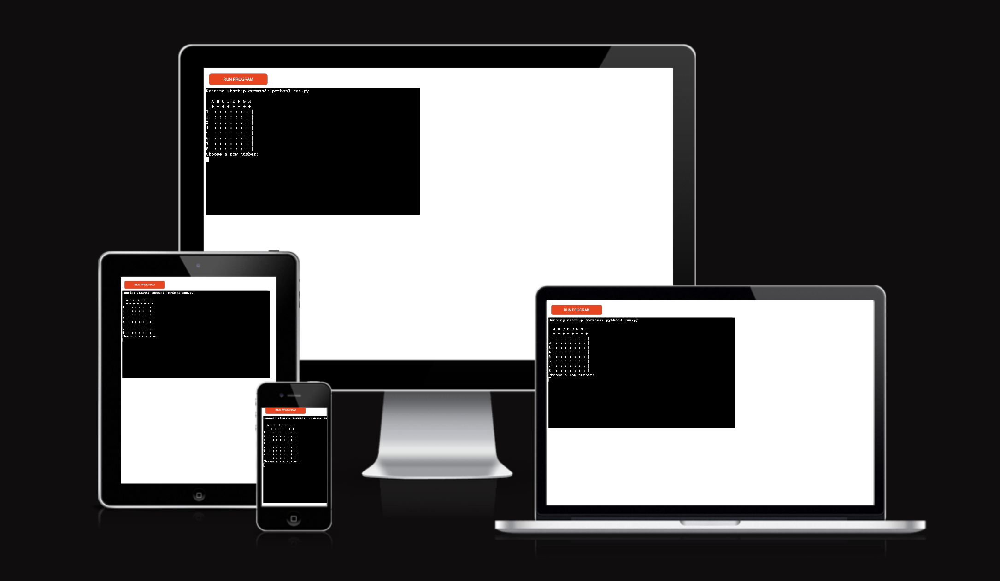
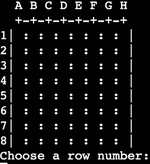

# PIRATE WAR (Battleship) v.2

Pirate War (Battleship) is a Python terminal game. The game runs using the Code
Institute mock terminal on Heroku.

This game is inspired on the classic BattleShip game; more information on the game can be better explain and found on it's [wikipedia site](https://en.wikipedia.org/wiki/Battleship_(game))

This is the second version i made, after review and suggested amendments by the Code Institute's assessment team.

## Assessment result.
---

- Please dive deeper into this project and add more advanced manipulation functionality. You can consider storing the username and result on the external data resource or setting up different board sizes.
    - For this version i did include feature to select board size.
- Error handling didn't cover empty input.
    - Error found and fixed, steps will be explained in bugs section.
- Application breaks if a user enters blank/invalid input, which must be fixed.
    - Error found and fixed, steps will be explained in bugs section.
- Error handling messages could be more specific.
    - Message strings were modified to be more specific on how to approach error solving.
- Testing section lacks details. 
    - Manual testing are being included in Testign section.
- Have detailed test guidelines, steps and results in the testing section.
    - Manual testing are being included in Testign section.
- PEP8 validation tool is mentioned in the README file, and results are documented, but detailed testing steps and guidelines are missing.
    - PEP8 testing are being included in Testign section.
- Consider using more librarles in future projects.
    - My next Python project is a Loan Calculator, i'm working on developing my coding skills by importing functions to better accomplish tasks with a DRY mindset.
- The criteria can be passed as long as commits made for resubmission are small in nature and made up of descriptive messages.
    - As i walk foreward in this field. I understand the usage of certail tools, such as commit messages. Now i know them work as a log book for activities made on the project. In my current repositories i will make shorter commits and continue writting clear mesages to document my working process.

## How to Play
---

1. The Game starts by asking the player to choose the difficulty mode by typing "1" for easy or "2" for hard.
    - "1" - Easy Game, board will be 5x5.
    - "2" - Hard Game, board will be 8x8.
2. The purpose of the game is to destroy 5 ships hidden on the Board.
3. Then, must select a number for a Column and a letter  for row, letter and numbers are creates according to board's size.
4. The player Begins with 10 shots (Cannon Balls).
5. If the player destroys one ship, 3 Cannon Balls will be added to the stock.
6. In order to WIN the player must find all 5 ships before he ran out of Cannon Balls.

## Features
---

- Pirate ships are randomly placed on the board.
- Theres a Header and column to easily identify where to shoot.
- The player can't see where the ships are unless they're destroyed.
- The user have a counter to be aware of how many turns left remain.
- Accepts user inputs
- The input data is validated and check for errors
    - First input only accepts numbers from 1 to 8.
    - Second input only accepts letters from A to H and Uppercase them to match the code validation.
    - If there's an error the input will be required again.
    - The same guess can not be entered twice.

### Future Features

- Add difficulty levels by increasing the ships or shoot number.
- Add diferent layotus for ships, with more than one space.
- Improvements in design and sounds. 

## Data Model
---

I wrote the code using two classes. 

- **gameboard** for the board and its frame.
    - **get_letter_to_num**: Translates the Input from user into default list numbers.
    - **print_board**:  Creates board we will use for the game, starting with one row one and loop

- **battleship** Creates ships and handle it's behavior.
    - **create_ships**: Place the ships randomly inside the board.
    - **get_user_input**: Ask for input and verifies if valid, will run until a valid input.
    - **count_hit_ships**: Runs loop thru the table and when finds an "X" fills the hit_ship variable.

- **choose_difficulty** function allows the player to choose game type and stablish the variable to be used as board size.

- **run_game** function starts the game, stablishing the lenght of the board.

Then sets 10 turns to begin the game, and will increment x3 everytime a ship is sunked.

## Testing
---

I have manually ...
- Gave invalid and repeated inputs.
- Tested in my local terminal as well as in Heroku.
- Passed the code through a PEP8 linter and there are two errors on lines 39 and 41.

## Bugs
---

- Blank input breaks code.
    - 
- When i wrote the code, i was getting errors in the PEP8 linter, some for missing spacing and also too long strings; therefore i used short variables to replace long name. However i could not repair the errors on line 39 and 41; i hope there are not signficant errors.
- There are no remainig bugs im aware of.

## Deployement
---
This project was deployed using Code Institute's mock terminal for Heroku.
- Steps for deployement
    - Fork or clone this repository.
    - Create a new Heroku app.
    - Set the buildbacks to Python and NodeJS in that order.
    - Link the Heroku app to the repository.
    - Click on **Deploy**

## Credits
---
- I consulted [**Knowledge Mavens**](https://www.youtube.com/@KnowledgeMavens) youtube channel, in order to correctly writte and comptrolling indentitation of my code.
- Code Institute for the deployment template.
- Wikipedia for the details of the battleship game.